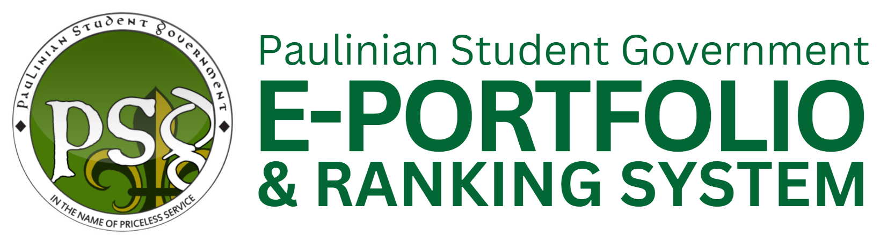

# Student Council Ranking System



An e-portfolio and ranking system for the Paulinian Studen Govenrment built with Laravel 11 and Filament v4. This system manages council evaluations, peer assessments, portfolio management, and certificate generation.

## System Overview

This application provides the systematic evaluation of student council members through:
- **Multi-tiered evaluation process** (Self, Peer, Adviser evaluations)
- **Portfolio management** for student achievements
- **Automated ranking calculations** based on evaluation scores
- **Certificate generation** for outstanding performers
- **Administrative dashboard** for managing councils, users, and evaluations

## Project Architecture

```
Student Council Ranking System
├── app
│   ├── Models
│   │   ├── User.php                    # Students, advisers, evaluators
│   │   ├── Council.php                 # Student councils/organizations
│   │   ├── Evaluation.php              # Evaluation sessions
│   │   ├── EvaluationForm.php          # Form responses & scoring engine
│   │   ├── EvaluationPeerEvaluator.php # Peer evaluation assignments
│   │   ├── EvaluationRank.php          # Final ranking calculations
│   │   └── Certificate.php             # Achievement certificates
│   │
│   ├── HTTP
│   │   └── Controllers/
│   │       └── EvaluationSubmissionController.php # Custom evaluation controller
│   │
│   └── Filament
│       ├── Resources/                  # CRUD Operations
│       │   ├── Users/                  # User management
│       │   ├── Councils/               # Council management
│       │   ├── Evaluations/            # Evaluation setup
│       │   ├── MyEvaluations/          # Evaluator interface
│       │   ├── MyPortfolio/            # Student portfolios
│       │   └── Certificates/           # Certificate management
│       └── Pages/ 
│           ├── Auth/ EditProfile.php   # Personal details management
│
├── resources/
│   └── views/
│       ├── EvaluationForm/             # Custom evaluation interfaces
│       └── Portfolio/                  # Portfolio display templates
```
