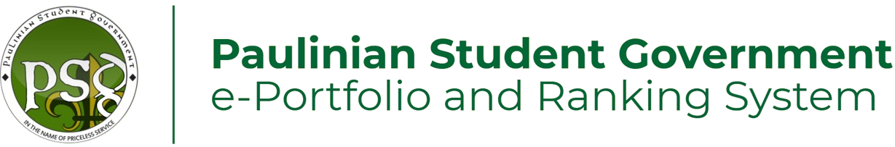
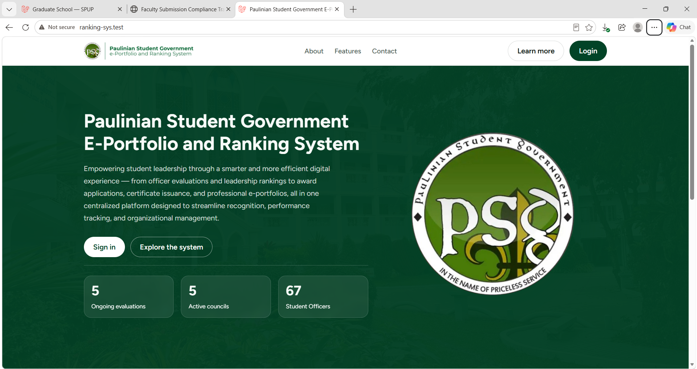
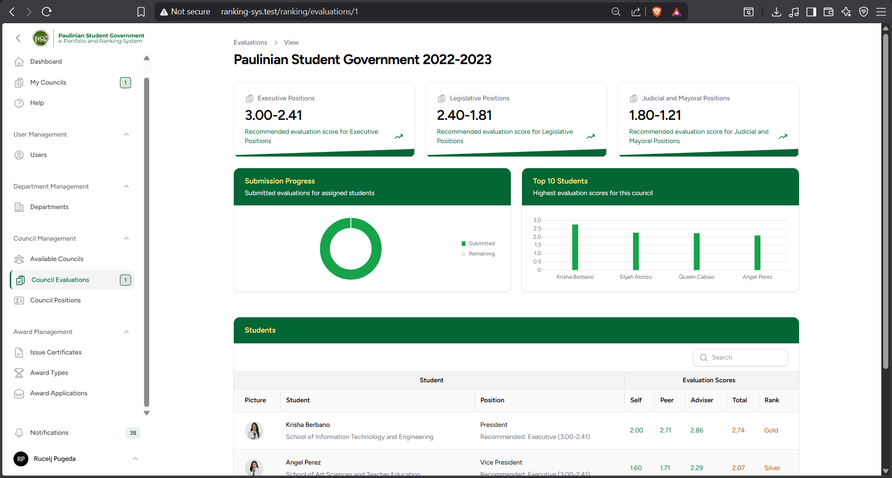
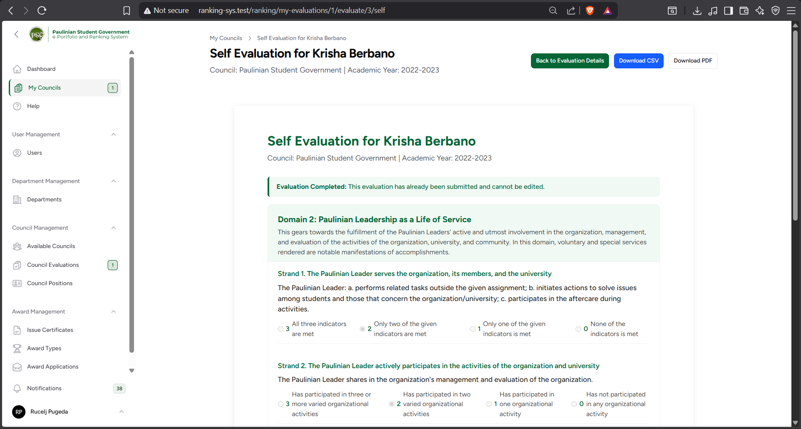
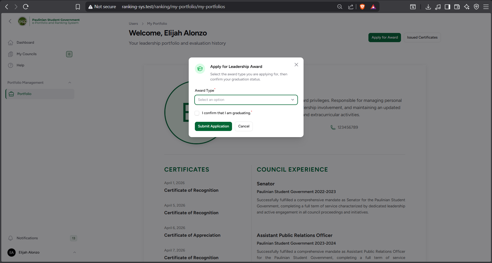

    

 A capstone project developed to automate student evaluation, score tallying, and ranking, replacing manual processes with an online evaluation platform. The system allows students to apply for leadership awards, complete evaluations, and provides the council with tools to manage evaluations, automate performance-based rankings, and issue digital certificates. 

### Council Evaluation & Management

The Council Evaluation and Management section provides the council with access to review and manage student evaluations. It promotes transparency throughout the evaluation process while giving authorized council members a centralized way to monitor submissions and evaluation results.

### Online Evaluation

The Online Evaluation section allows students to complete their required evaluation forms digitally. This replaces manual evaluation forms with an online process, making it easier to collect responses and organize evaluation data for scoring and ranking.

### Leadership Award Application

The Leadership Award Application allows students to submit their applications for leadership awards online. It replaces manual application processes with a centralized digital platform, making submissions easier to manage and reducing the administrative effort required to collect applications.

